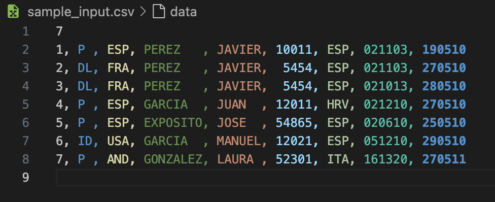

# TestConsoleAppWithDI

This solution serves as a base for exploring and testing new features of C# and .NET, it uses Ninject for DI and unit testing using NUnit.

We will implement a ScannedDocumentInformationParder.

The program will take lines, one by one, by reading console input. The sample_input.txt contains an example of input. However, please remember that the input is not file-based but console-based.



First line will contain an integer N denoting the number of records, followed by N lines with one
record per line.

Each record contains the following information separated by commas:
- scan id (numeric)
- Document Type (P|ID|DL)
- Issuing country
- Last Name
- First Name
- Document number (numeric)
- Nationality
- Date Of birth
- Date of Expiry

## Project Structure

### TestConsoleAppWithDI
This is the main console application project. It includes:
- **`ConsoleAppEntryPoint.cs`**: The entry point for the application logic.
- **`IScannedDocumentInformationParser.cs`**: Interface for the document parser.
- **`ScannedDocumentInformationParser.cs`**: Implementation of the document parser, enabling dependency injection.
- **`Program.cs`**: The main entry point of the application.
- **`Boot/`**: Contains the `Bootstrapper` and `Module` classes for setting up DI.

### TestConsoleAppWithDITest
This is the unit test project for the console application. It includes:
- **`ConsoleAppEntryPointTest.cs`**: NUnit test cases for the console application entry point.

## Features
- **C# .NET 9**: Leverages new language features introduced in .NET 9.
- **Dependency Injection**: Implements DI using a modular approach.
- **Unit Testing**: Uses NUnit for writing and running tests.

## Getting Started

1. Clone the repository:
   ```bash
   git clone https://github.com/Podmantastic/TestConsoleAppWithDI
2. Open the solution in Visual Studio or your preferred IDE.
3. Build the solution:
   ```bash
   dotnet build
4. Run the application:
   ```bash
   dotnet run --project TestConsoleAppWithDI
5. Run the tests:
   ```bash
   dotnet test
## Requirements
.NET SDK 9.0 or later
NUnit for testing

## Contributing
Feel free to fork this repository and submit pull requests to add new features or improve the existing code.

## License
This project is licensed under the MIT License. ```